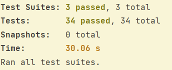
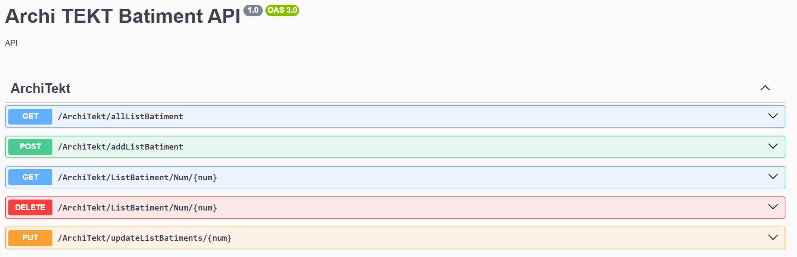
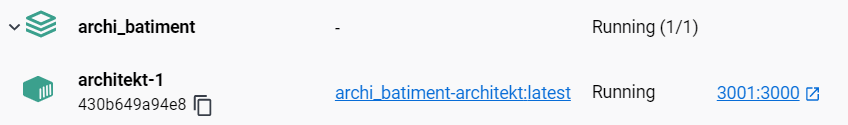

# Archi TEKT Batiment API

Ce projet NestJS implémente une API pour calculer le stockage maximum d'eau sur une liste de bâtiments. Il fournit à la fois une solution non optimale pour la compréhension et une solution optimisée pour une intégration directe dans un logiciel.

## Table des matières
- [Aperçu du projet](#aperçu-du-projet)
- [Mise en route](#mise-en-route)
    - [Prérequis](#prérequis)
    - [Installation](#installation)
- [Exécution des tests](#exécution-des-tests)
- [Exécution de l'application](#exécution-de-application)
- [Utilisation de l'API](#utilisation-de-lapi)
    - [Calcul du Stockage d'Eau](#calcul-du-stockage-deau)
- [Documentation](#documentation)
- [Gestion des erreurs](#gestion-des-erreurs)
- [Journaux](#journaux)
- [Conteneurisation](#conteneurisation)
- [Stockage des données](#stockage-des-données)


## Aperçu du projet

Ce projet NestJS vise à résoudre le problème du calcul du stockage maximal d'eau sur une liste de bâtiments. Il fournit une API claire pour une intégration facile.


## Mise en route

### Prérequis

- Node.js (version 16 ou supérieure)
- npm 
- MongoDB 


### Installation

Clonez le dépôt et installez les dépendances :

```bash
git clone https://github.com/SoulaimakH/Archi_batiment.git
cd Archi_batiment
npm install 
```

## Exécuter tous les tests
```bash
npm run test
```


## Exécution de l'application
```bash
# development
$ npm run start

# watch mode
$ npm run start:dev

# production mode
$ npm run start:prod
```

## Utilisation de l'API
L'API fournit plusieurs fonctionnalités pour la gestion des bâtiments.

Consultez la `documentation Swagger` pour une référence détaillée des points d'accès des schémas de requête et de réponse.


#### Récupérer les Listes de Bâtiments avec Surface d'Eau Stockée

Endpoint : `GET /ArchiTekt/allListBatiment`

Récupérez la liste complète de tous les bâtiments avec la surface d'eau stockée en utilisant la méthode GET.

Exemple de requête :
```http
GET /ArchiTekt/allListBatiment
```

#### Création et Enregistrement d'une Nouvelle Liste de Bâtiments

Endpoint : `POST /ArchiTekt/addListBatiment`

Ajoutez une nouvelle liste de bâtiments avec le calcul de la surface d'eau.
Exemple de requête :
```http
POST /ArchiTekt/addListBatiment
Content-Type: application/json
{
  "buildingsHeightList": [1,2,3]
}
```

#### Récupérer une Liste de Bâtiments par Numéro

Endpoint : `GET /ArchiTekt/getListBatiment/123`

Récupérez les détails d'une liste spécifique en utilisant la méthode GET. Remplacez :num par le numéro de la liste.
Exemple de requête :
```http
GET /ArchiTekt/getListBatiment/123
```

#### Modifier une Liste de Bâtiments par Numéro

Endpoint : `PUT /ArchiTekt/updateListBatiments/:num`

Modifiez les informations d'une liste spécifique en utilisant la méthode PUT. Remplacez :num par le numéro de la liste à mettre à jour.

```http
PUT /ArchiTekt/updateListBatiments/789
Content-Type: application/json
{
  "buildingsHeightList": [1,2,3]
}
```

#### Supprimer une Liste de Bâtiments par Numéro

Endpoint : `DELETE /ArchiTekt/deleteListBatiment/:num`

Supprimez une liste spécifique en utilisant la méthode DELETE. Remplacez :num par le numéro de la liste à supprimer.
```http
DELETE /ArchiTekt/deleteListBatiment/456
```


### Calcule du Stockage d'Eau

L'objectif est de déterminer la quantité maximale d'eau stockée en calculant la capacité de rétention d'eau pour chaque emplacement.

Les extrémités de la liste, c'est-à-dire le début et la fin, ne présentent pas de barrières, permettant ainsi à l'eau de s'écouler librement.

Pour les positions intermédiaires, nous devons évaluer le nombre de blocs d'eau qui peuvent potentiellement être stockés. 
L'eau peut s'écouler librement s'il n'y a pas de barrière. À chaque position `i`, nous calculons le minimum entre la hauteur maximale à gauche et la hauteur maximale à droite. 
Ensuite, nous soustrayons la hauteur de la position actuelle `buildingsHeightList[i]` de ce résultat pour obtenir la quantité d'eau stockée à cette position.

##### Formule :
`Quantité d'eau stockée à la position i = min(hauteur maximale à gauche, hauteur maximale à droite) - hauteur à la position i`


Le service `CalculeMaxSurfaceEauService` offre deux fonctions pour calculer la surface maximale d'eau stockée pour une liste de hauteurs de bâtiments donnée.

#### Fonction Optimale

La fonction optimale `calculeMaxSurfaceEau_Optimized` utilise une approche à deux pointeurs pour optimiser le calcul de la surface d'eau. Cette méthode est plus efficace en termes de complexité algorithmique.


#### Fonction non optimale
La fonction `calculeMaxSurfaceEau` utilise une approche itérative pour calculer la surface d'eau stockée.

Cette approche non optimale a une complexité temporelle plus élevée que l'approche optimisée utilisée dans calculeMaxSurfaceEau_Optimized, mais elle est plus compréhensible. Elle parcourt chaque position et effectue les calculs nécessaires pour déterminer la quantité d'eau stockée.

## Gestion des Erreurs
L'API prend en charge la gestion appropriée des erreurs pour garantir une expérience utilisateur fiable. Les réponses d'erreur sont accompagnées de codes HTTP et de messages explicatifs pour comprendre et résoudre les problèmes potentiels. 
Voici quelques scénarios de gestion d'erreur pris en charge :

### Codes de Réponse HTTP

- **200 OK** : La requête a été traitée avec succès.
- **400 Bad Request** : La requête est incorrecte ou mal formée. Un message explicatif accompagne généralement cette erreur pour indiquer la nature du problème.
- **404 Not Found** : La ressource demandée n'a pas été trouvée.
- **500 Internal Server Error** : Une erreur interne s'est produite du côté du serveur. Les logs de l'application enregistrent des informations détaillées sur ces erreurs.

## Journaux (Logs)
Pour mettre en place une gestion de journaux robuste et suivre l'activité de l'application. 
Les journaux sont essentiels pour le débogage, la surveillance et l'amélioration continue de notre application.

### Configuration de Winston
Winston est une bibliothèque flexible et extensible pour Node.js qui nous permet de gérer efficacement les journaux.

Le fichier `winston.logger.ts` définit la configuration des journaux dans notre application. Nous avons adapté cette configuration pour répondre aux besoins de développement (`dev`) et de production (`prod`).

#### Environnement de Développement (dev)

En environnement de développement, les journaux sont configurés pour s'afficher dans la console. 
Cela facilite le débogage et la surveillance en temps réel.

#### Environnement de Production (prod)
En environnement de production, les journaux sont enregistrés dans deux fichiers distincts : `error.log` pour les erreurs et `combine.log` 
pour les autres informations.

## Containerisation
L'application est conteneurisée à l'aide de Docker

Le fichier `Dockerfile` à la racine du projet définit les étapes nécessaires pour créer l'image Docker.

`Docker Compose` définir et gérer l'environnement complet de l'application.

Le conteneur expose le port `3001`.

##### Démarrer et construire le conteneur `docker-compose up -d`

##### Arrêter le conteneur `docker-compose down`


Accédez à l'application via http://localhost:3001.

## Stockage des Données

### Environnement de Développement (dev)
En développement, les données sont stockées localement sur une base MongoDB. 
Assurez-vous d'avoir MongoDB installé localement avant de lancer l'application en mode développement.
Vous pouvez utiliser Docker pour simplifier l'installation et la gestion de MongoDB en mode développement.
`docker run -d -p 2717:27017 --name mon-mongodb mongo:latest`

### Environnement de Production (prod)
En production, l'application se connecte à une base de données MongoDB hébergée dans le cloud. Aucune configuration supplémentaire n'est nécessaire, car l'application utilisera les informations d'identification appropriées pour accéder à la base de données distante.